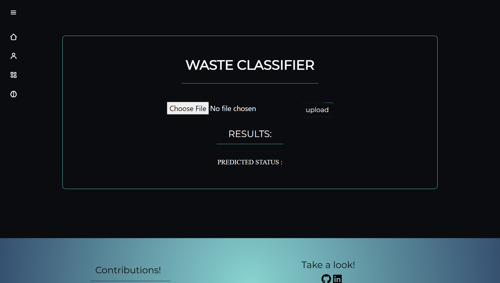

# Waste-Classifcation-web-app
Waste Classifier web app is used to predict the type of waste(Organic/Recyclable) from an image. 
Here a pretrianed model-Vgg19B-is trained and fine-tuned for our classfier.</br> We've added another genai feature, Our Image Describer.
We integrated and used google's GeminiAI for our describer module. Later we Dockerized the webapp and deployed it using render Cloud.
Created using python's tensorflow, Fastapi, numpy and joblib packages.


## Dataset Description

The dataset consist of two classes, Organic and Recyclable.

The data contains the following columns:

| Feature Name               | Feature Description                                                                                 |
| -------------------------- | --------------------------------------------------------------------------------------------------- |
| Organic                    | Images of Organic Waste(plants, flower, leaves, etc.)                                               |
| Recyclable                 | Images of Recyclable Waste(paper, plastic, etc.)                                                    |


## Site Link:

https://waste-classifcation-for-optimal-waste.onrender.com/

## Installation

Open Anaconda prompt and create new environment

```
conda create -n your_env_name python = (any_version_number > 3.11.0)
```

Then Activate the newly created environment

```
conda activate your_env_name
```

Clone the repository using `git`

```
git clone gh repo clone Baktho-SN/Waste_Classifcation_for_optimal_waste_management
```

Change to the cloned directory

```
cd <directory_name>
```

To install all requirement packages for the app

```
pip install -r requirements.txt
```

Then, Run the app

```
uvicorn main:app --reload
```

## 📷 Screenshots

### Website





## Classifier Demo


## Describer Demo


